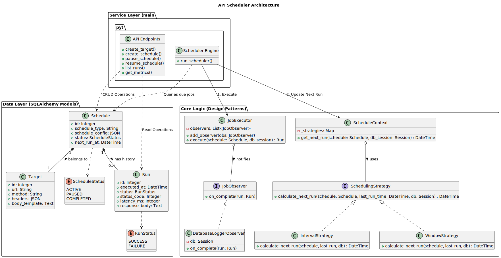

# API Scheduler (Cron-like Job Runner)

A robust, persistent backend service that schedules and executes HTTP requests to external targets. Built with **FastAPI**, **SQLAlchemy**, and **SQLite**, it supports both recurring intervals and time-windowed execution strategies.

## 🚀 Features

* **Dynamic Scheduling:** Create jobs that run on a fixed interval or within a specific time window.
* **Persistence:** All schedules and run history are stored in a database (SQLite). Jobs survive server restarts.
* **Concurrency:** Uses a `ThreadPoolExecutor` to run HTTP requests in parallel, preventing slow endpoints from blocking the scheduler.
* **Observability:** Tracks execution history, status codes, latency, and response bodies.
* **Control:** Pause, resume, and delete schedules on the fly.

---

## 🏗 System Design & Architecture

### 1. Core Design Patterns

To keep the codebase modular and extensible, we utilized several GoF design patterns:

* **Strategy Pattern:** Used for the scheduling logic. The `SchedulingStrategy` abstract base class allows us to easily swap between `IntervalStrategy` and `WindowStrategy` without changing the core engine.
* **Observer Pattern:** The `JobExecutor` emits events (e.g., `on_complete`). The `DatabaseLoggerObserver` listens to these events to save logs to the DB. This decouples execution logic from logging logic.
* **Factory Pattern:** (Implicit) Used in the API layer to instantiate the correct schedule configurations based on user input.

### 2. Concurrency & Performance

* **Optimistic Scheduling:** The scheduler calculates and updates the `next_run_at` timestamp *before* execution begins. This prevents double-execution if the loop runs faster than the job.
* **Thread Pool Execution:** Network I/O (HTTP requests) is offloaded to a `ThreadPoolExecutor`. This ensures that a single slow target (e.g., one that takes 10s to respond) does not block other jobs from firing.

### 3. Fault Tolerance (Handling Restarts)

* **Persistence:** The "Queue" is actually a database table.
* **Catch-Up Mechanism:** When the system restarts, the scheduler queries for all active jobs where `next_run_at <= NOW()`.
* If the server was down for an hour, all missed jobs become "due" immediately.
* The scheduler picks them up and resumes execution instantly.

---

## 📐 Low-Level Design (LLD)



This system separates **Data (Entities)** from **Behavior (Services)** to ensure testability and modularity.

### 1. Entity-Relationship Model (Data Layer)

We use **SQLAlchemy ORM** to define relationships between resources.

* **Target (`1`) ↔ Schedule (`N`):** A single external API (Target) can have multiple different schedules (e.g., one running every 5s, another running once a day).
* **Schedule (`1`) ↔ Run (`N`):** Every time a Schedule executes, it creates a `Run` record (History/Logs).

### 2. Service Layer Design Patterns

We implemented specific GoF patterns to handle complexity:

* **Strategy Pattern (`core_logic.py`):**
* **Problem:** Different schedules (Interval vs. Window) calculate "next run time" differently.
* **Solution:** We define an abstract `SchedulingStrategy`. The `ScheduleContext` dynamically selects the correct strategy (`IntervalStrategy` or `WindowStrategy`) at runtime. This allows adding new types (e.g., "CronStrategy") without touching the main engine.


* **Observer Pattern (`core_logic.py`):**
* **Problem:** The code that runs the HTTP request shouldn't care about *saving* to the database or sending metrics.
* **Solution:** The `JobExecutor` emits events. A `DatabaseLoggerObserver` subscribes to these events and handles the DB writes. This adheres to the **Single Responsibility Principle**.


### 3. Execution Flow (Entity-Service Interaction)

1. **Scheduler Engine (Service):** Polls the database for `Schedule` entities where `next_run_at <= NOW`.
2. **Context (Factory):** The engine passes the `Schedule` to `ScheduleContext` to calculate the *next* execution time.
3. **Executor (Service):** The engine passes the `Schedule` to `JobExecutor`.
4. **Target (Entity):** The executor reads the `Target` data (URL, Headers) associated with the schedule to perform the HTTP request.
5. **Run (Entity):** The executor (via Observer) creates a new `Run` entity to log the result.

---

## 🛠 Project Setup

### Prerequisites

* Python 3.9+
* pip

### Installation

1. **Clone the repository:**
```bash
git clone https://github.com/Aman-Khan/API-Scheduler
cd api_scheduler/backend

```


2. **Install Dependencies:**
```bash
pip install -r requirements.txt

```


3. **Run the Server:**
```bash
uvicorn main:app --reload

```

4. **Setup Frontend:**
```bash
cd ../frontend

```

5. **Install Dependencies:**
```bash
npm install

```

6. **Run Server:**
```bash
npm run dev

```

The API will start at `http://127.0.0.1:8000`.

---

## 📚 API Reference

You can view the interactive documentation at `http://127.0.0.1:8000/docs`.

### Targets

* `POST /targets/` - Register a new external API target.
* `GET /targets/` - List all registered targets.
* `DELETE /targets/{id}` - Remove a target (only if unused).

### Schedules

* `POST /schedules/` - Create a new job.
* `GET /schedules/` - List all jobs.
* `POST /schedules/{id}/pause` - Pause a job.
* `POST /schedules/{id}/resume` - Resume a paused job.
* `DELETE /schedules/{id}` - Stop and delete a job.

### Observability

* `GET /runs/?schedule_id={id}` - View execution logs (history).
* `GET /metrics` - View system-wide health stats (Success rates, Avg latency).

---

## 🧪 Testing Guide

You can test these scenarios using **Postman**, **curl**, or the **Swagger UI** (`/docs`).

### 1. Happy Path: Interval Schedule

*Run a GET request every 10 seconds.*

**Step 1: Create Target**

```json
POST /targets/
{
  "url": "https://httpbin.org/get",
  "method": "GET",
  "headers": {"User-Agent": "TestBot"}
}

```

*(Note the returned `target_id`, e.g., `1`)*

**Step 2: Create Schedule**

```json
POST /schedules/
{
  "target_id": 1,
  "schedule_type": "INTERVAL",
  "schedule_config": {
    "interval_seconds": 10
  }
}

```

**Verification:** Wait 20 seconds, then call `GET /runs/?schedule_id=1`. You should see 2 successful runs.

### 2. Complex Scenario: Window Strategy with Throttling

*Run every 5 seconds, but STOP after 3 runs OR when time expires.*

**Step 1: Create Target**

```json
POST /targets/
{
  "url": "https://httpbin.org/uuid",
  "method": "GET"
}

```

*(Assume `target_id` is `2`)*

**Step 2: Create Window Schedule**

```json
POST /schedules/
{
  "target_id": 2,
  "schedule_type": "WINDOW",
  "schedule_config": {
    "start_time": "now",
    "end_time": "2026-12-31T23:59:59",
    "interval_seconds": 5,
    "max_runs": 3
  }
}

```

**Verification:**

1. Watch the console logs. You will see it execute 3 times.
2. After the 3rd run, check `GET /schedules/2`. The status should be `COMPLETED`.

### 3. Fault Tolerance Test (Restart)

1. Create an **Interval Schedule** (every 10s).
2. Let it run once.
3. **Kill the server** (`Ctrl+C`).
4. Wait 30 seconds.
5. **Restart the server** (`uvicorn main:app --reload`).
6. **Observation:** The scheduler will immediately detect the "missed" run and execute it. It does not lose the job.

### 4. Validation Failure Test

*Try to create a schedule where the Interval is larger than the Window.*

**Request:**

```json
POST /schedules/
{
  "target_id": 1,
  "schedule_type": "WINDOW",
  "schedule_config": {
    "start_time": "now",
    "end_time": "now + 1 minute", 
    "interval_seconds": 3600
  }
}

```

**Result:** `422 Unprocessable Entity` with message: *"Rate (Interval 3600s) cannot be greater than the Window duration"*.

---

## ⚖️ Trade-offs & Limitations

While the current architecture is robust for standard use cases, certain design choices were made to prioritize simplicity and ease of setup over massive horizontal scalability.

1. **SQLite vs. High Concurrency:**
* **Limitation:** SQLite uses a file-level write lock. While we use a `ThreadPoolExecutor` for network requests, the database itself cannot handle thousands of concurrent *writes* per second.
* **Impact:** If you spin up multiple instances of this API (e.g., via Docker), they will contend for the same file, potentially causing "Database Locked" errors.
* **Constraint:** This system is designed to run as a **single instance**.


2. **In-Memory Job Execution:**
* **Limitation:** The HTTP requests are triggered by a Python thread in the same process as the API.
* **Impact:** A heavy load of concurrent network requests could consume all server memory/CPU, degrading the API's responsiveness (e.g., user endpoints might get slow).


3. **Polling Precision:**
* **Limitation:** The scheduler loop sleeps for 5 seconds between checks.
* **Impact:** Jobs are not guaranteed to run at the *exact* millisecond they are scheduled. There is a potential drift of 0-5 seconds.


---

## 🔮 Future Improvements (Production Readiness)

To take this system from a robust utility to a high-scale enterprise service, the following upgrades are recommended:

1. **Database Migration (PostgreSQL):**
* Replace SQLite with **PostgreSQL**.
* Utilize `SELECT ... FOR UPDATE SKIP LOCKED`. This allows running **multiple scheduler instances** (Horizontal Scaling) where each instance grabs a unique batch of jobs without overlapping.


2. **Distributed Task Queue (Celery/Redis):**
* Decouple the **Scheduler** (finding jobs) from the **Executor** (running jobs).
* Instead of running `requests.get` inside the API thread, push a message to a **Redis Queue**.
* Have a separate fleet of **Celery Workers** consume these messages. This allows you to scale the "runners" independently of the "scheduler."


3. **Resilience & Retries:**
* Implement an "Exponential Backoff" strategy. If a target returns `500 Internal Server Error`, the system should automatically retry after 1s, 2s, 4s, etc., before marking it as `FAILURE`.


4. **Security:**
* Add **API Key Authentication** or OAuth2 to protect the endpoints, ensuring only authorized users can create or delete schedules.
